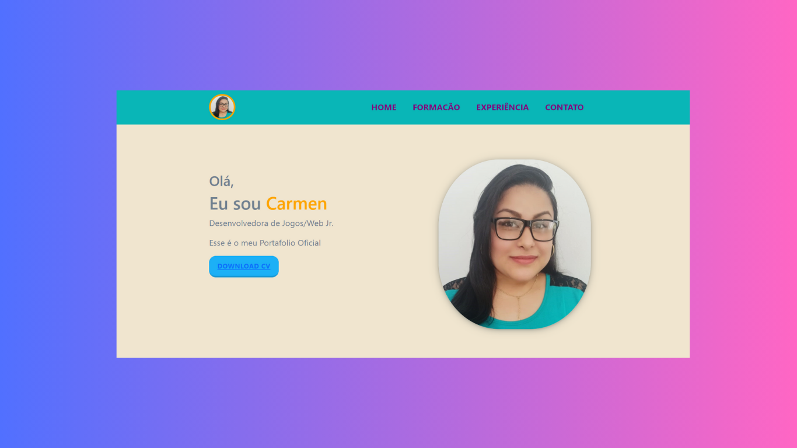

<h1 align="center">Projeto Final de CSS</h1>

Este é um projeto final proposto pelo curso Toti Diveridade.
 

  <a href="#-tecnologias">Tecnologias</a>&nbsp;&nbsp;&nbsp;|&nbsp;&nbsp;&nbsp;
  <a href="#-projeto">Projeto</a>&nbsp;&nbsp;&nbsp;|&nbsp;&nbsp;&nbsp;
  <a href="#%EF%B8%8F-licença">Licença</a>

  

 

  

## 🚀 Tecnologias

Esse projeto foi desenvolvido com as seguintes tecnologias:

- HTML
- CSS

## 💻 Projeto

Este repositório é o resultado de um projeto final proposto no curso de Toti, no qual foi desenvolvido um portfólio pessoal.

## 🔗 Acceso

https://ofelia-1985.github.io/Projecto_css/

## 🗝️ Licença

Esse projeto está sob a licença MIT.

---

Feito com ♥ 
